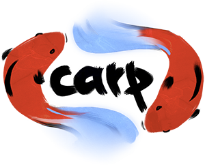

# Carp



[](https://github.com/carp-lang/Carp/actions?query=workflow%3A%22Linux+CI%22)
[](https://github.com/carp-lang/Carp/actions?query=workflow%3A"MacOS+CI")
[](https://github.com/carp-lang/Carp/actions?query=workflow%3A"Windows+CI")

<i>WARNING! This is a research project and a lot of information here might become outdated and misleading without any explanation. Don't use it for anything important just yet!</i>

<i>[Version 0.5.1 of the language is out!](https://github.com/carp-lang/Carp/releases/)</i>

## About

Carp is a programming language designed to work well for interactive and performance sensitive use cases like games, sound synthesis and visualizations.

The key features of Carp are the following:
* Automatic and deterministic memory management (no garbage collector or VM)
* Inferred static types for great speed and reliability
* Ownership tracking enables a functional programming style while still using mutation of cache-friendly data structures under the hood
* No hidden performance penalties – allocation and copying are explicit
* Straightforward integration with existing C code
* Lisp macros, compile time scripting and a helpful REPL

## Learn more
* [The Compiler Manual](docs/Manual.md) - how to install and use the compiler
* [Carp Language Guide](docs/LanguageGuide.md) - syntax and semantics of the language
* [Core Docs](http://carp-lang.github.io/carp-docs/core/core_index.html) - documentation for our standard library

[](https://gitter.im/eriksvedang/Carp?utm_source=badge&utm_medium=badge&utm_campaign=pr-badge&utm_content=badge)

## A Very Small Example

```clojure
(load-and-use SDL)

(defn tick [state]
  (+ state 10))

(defn draw [app rend state]
  (bg rend &(rgb (/ @state 2) (/ @state 3) (/ @state 4))))

(defn main []
  (let [app (SDLApp.create "The Minimalistic Color Generator" 400 300)
        state 0]
    (SDLApp.run-with-callbacks &app SDLApp.quit-on-esc tick draw state)))
```

For instructions on how to run Carp code, see [this document](docs/HowToRunCode.md).

For more examples, check out the [examples](examples) directory.

## Maintainers
- [Erik Svedäng](https://github.com/eriksvedang)
- [Veit Heller](https://github.com/hellerve)
- [Jorge Acereda](https://github.com/jacereda)
- [Scott Olsen](https://github.com/scolsen)
- [Tim Dévé](https://github.com/TimDeve)

## Contributing
Thanks to all the [awesome people](https://github.com/carp-lang/Carp/graphs/contributors) who have contributed to Carp over the years!

We are always looking for more help &ndash; check out the [contributing guide](docs/Contributing.md) to get started.

## License

Copyright 2016 - 2021 Erik Svedäng

Licensed under the Apache License, Version 2.0 (the "License");
you may not use this file except in compliance with the License.
You may obtain a copy of the License at

    http://www.apache.org/licenses/LICENSE-2.0

Unless required by applicable law or agreed to in writing, software
distributed under the License is distributed on an "AS IS" BASIS,
WITHOUT WARRANTIES OR CONDITIONS OF ANY KIND, either express or implied.
See the License for the specific language governing permissions and
limitations under the License.

The regular expression implementation as found in src/carp_regex.h are
Copyright (C) 1994-2017 Lua.org, PUC-Rio under the terms of the MIT license.
Details can be found in the License file LUA_LICENSE.
