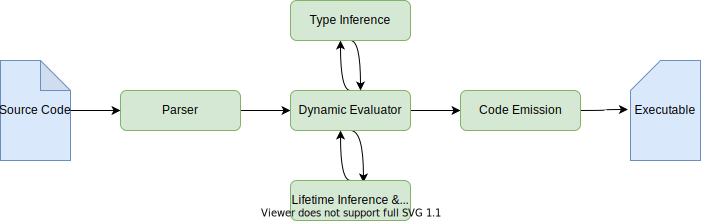

# Macros

Macros are among the most divisive features about any Lisp. There are many
different design decisions to be made, and all of them have proponents and
detractors.

This document aims to give a comprehensive overview of the macro system and how
to use it. If you’re in a hurry or want to see whether Carp implements your
favorite macro feature, you probably want to read the section [“In a
Nutshell”](#in-a-nutshell). If you want to spend some quality time
understanding how to work on or with the macro systems, the sections [“Working
with Macros”](#working-with-macros) and [“Inner Workings”](#inner-workings)
will probably be more useful to you.

## In a Nutshell

The macro system we’ve settled on for Carp is fairly simple. It is:

- not hygienic, but provides `gensym` capabilities,
- does not currently provide quasiquoting (this is not a requirement, it is
  currently just not implemented); thus the bread and butter in your macro
  toolbox will be `car`, `cdr`, `cons`, and `list`,
- defines macros with a fairly simple `defmacro`-based syntax, and has support
  for compile-time or dynamic functions (for more information on this aspect,
  please read [“Working with Macros”](#working-with-macros) below), and
- it sees the dynamic environment not just as an environment in which to
  generate code through expanding macros, but also as a place for telling the
  compiler more about the source. As an example, consider the dynamic function
  `Project.config`, which allows you to set such things as the C compiler to
  use, the name of the compiled project, or the output directory. To see this
  in action, consider [this Carp snippet](https://github.com/carpentry-org/snippets/blob/master/build_system.carp)
  which implements a simple multi-compiler build system for Carp in the dynamic
  environment.

## Working with Macros

Macros are defined using the `defmacro` primitive form, like this:

```clojure
(defmacro apply [f args] (cons f args))

(apply + (1 2)) ; => (+ 1 2)
(apply Array.replicate (5 "hello")) ; => (Array.replicate 5 "hello")
```

The example above defines `apply`, a macro that takes a function and a set of
arguments defined as a list and rewrites it so that the function gets applied
to these arguments by `cons`tructing a list with `f` as a head and `args` as
tail.

Because `apply` is a macro you will not need to quote the list passed to it. If
that looks strange, you might want to define `apply` as a dynamic function
instead. The main difference between macros and dynamic functions is that
dynamic functions evaluate their arguments and macros are expanded inside their
definitions. You may define a dynamic function like this:

```clojure
(defndynamic apply [f args] (cons f args))

(apply '+ '(1 2)) ; => (+ 1 2)
(apply 'Array.replicate '(5 "hello")) ; => (Array.replicate 5 "hello")
```

If you compare this code example to the macro example above, you’ll see that
they are extremely similar, except for the invocation `defndynamic` and the
quotes in their invocation.

Macros also provide rest arguments; this basically means that you may define
variadic macros by providing a “catch-all” argument as the last argument.

```clojure
(defmacro apply-or-sym [head :rest tail]
  (if (= (length tail) 0)
    head
    (cons head tail)))

(apply-or-sym *global*) ; => *global*
(apply-or-sym + 1 2) ; => (+ 1 2)
```

The macro `apply-or-sym` is slightly ridiculous, but it should drive the point
home. It takes one formal argument, `head`. You may provide any number of
arguments after that—they will be bound to `tail`. Thus, tail will be a list of
zero or more arguments. If we do not provide any, `apply-or-sym` will just
return `head`. If we do, we treat it as a regular invocation. This kind of
macro might look slightly silly, but rest assured that using rest arguments has
many legitimate use cases.

If you’d like to see more examples of macros big and small, you should now be
equipped to understand a lot of the macros in [the standard
library](/core/Macros.carp) and even [`fmt`](/core/Format.carp), a fairly
complex piece of macro machinery.

Some helpful functions for exploring macros in the REPL are `expand`, `eval`,
and `macro-log`. `expand` will expand macros for you, while `eval` evaluates
the resulting code. `macro-log` is useful for tracing your macro, a form of
“printf debugging”.

## Inner Workings

The Carp compiler is split in a few different stages. The diagram below
illustrates the flow of the compiler.



The dynamic evaluator is arguably one of the most central pieces of the Carp
compiler. It orchestrates macro expansion, borrow checking, and type inference,
as it encounters forms that have requirements for these services, such as
function definitions, variables, or `let` bindings.

Therefore, understanding the evaluator will give you a lot of insight into how
Carp works generally.

The most tried-and-true starting point for understanding the dynamic evaluator
is `eval` in [`src/Eval.hs`](/src/Eval.hs).

### Data Structures

The type signature of `eval` is as follows:

```haskell
eval :: Context -> XObj -> IO (Context, Either EvalError XObj)
```

Thus, to understand it, we’ll have to understand at least `Context`, `XObj`,
and `EvalError`. The types `IO` and `Either` are part of the Haskell standard
library and will not be covered extensively—please refer to your favorite
tool for Haskell documentation (we recommend [Stackage](https://stackage.org))
to find out more about them.

All data structures that are discussed here are defined in
[`src/Obj.hs`](/src/Obj.hs).

#### `XObj`

`XObj` is short for “`Obj` with eXtras”. `Obj` is the type for AST nodes in
Carp, and it’s used throughout the compiler. Most often, you’ll find it wrapped
in an `XObj`, though, which annotates such an `Obj` with an optional source
location information—in the field `info`, modelled as a `Maybe Info`—and
type information—in the field `ty`, modelled as a `Maybe Ty`. While both of
these fields are important, for the purposes of this document we will overlook
them and treat a `XObj` as an ordinary AST node. Thus, `eval` becomes a
function that takes a context and an AST node, and returns a pair consisting of
a new context, and either an `EvalError` or a new AST node.

#### `Context`

`Context` is a data structure that holds all of the state of the Carp compiler.
It is fairly extensive, holding information ranging from the type and value
environments to the history of evaluation frames that were traversed for
tracebacks.

The entire state of the compiler should be inspectable by inspecting its
context.

#### `EvalError`

An `EvalError` is emitted whenever the dynamic evaluator encounters an error.
It consists of an error message and meta information (such as a traceback and
source location information).

### Evaluation

The dynamic evaluator in Carp takes care both of evaluation and meta-level
information like definitions. This means that definitions are treated much like
dynamic primitives to evaluate rather than special constructs. In fact, many of
them are not treated as special forms, but are implemented as `Primitive`s.

Because we already introduced multiple constructs by name, let us define what
kinds of Carp constructs there are for the evaluator:

- Special forms: these are forms that have their own representation in the
  abstract syntax tree and are treated directly in the evaluator loop. `fn` and
  `the` are examples for this category. They cannot be passed around by value,
  as you would do in higher order functions.
- Primitives: these are regular Carp forms that do not evaluate their
  arguments, and they resemble builtin macros implemented in Haskell. Examples
  for this category include `defmacro`, `defn`, and `quote`.
- Commands: these, too, are regular Carp forms. They evaluate their arguments
  and behave like builtin functions. Examples for this category include
  `Project.config`, `car`, and `cons`.

Primitives are mostly defined in [`src/Primitives.hs`](/src/Primitives.hs),
commands can be found in [`src/Commands.hs`](/src/Commands.hs), and special
forms can be found directly inside `eval`.

They are wired up into the environment and given names in
[`src/StartingEnv.hs`](/src/StartingEnv.hs).

#### Adding your own special forms, primitives, or commands

While there is a lot of machinery involved in getting your own primitives or
commands into the Carp evaluator, there are a lot of simple functions around to
help you get started.

If the name for the primitive or command is already present as a runtime
function, it should try to mimic its behavior as closely as possible.

Adding special forms is a little more involved and we try to exercise caution
in what to add, since every form makes `eval` harder to understand and reason
about. You should probably get in touch [on the
chat](https://gitter.im/carp-lang/carp) before embarking on a quest to
implement a new special form to avoid frustration.

#### A current list of special forms

Since special forms are “magical”, they deserve an enumeration. Currently there
are:

- `if` for branching,
- `defn` for defining functions,
- `def` for defining global variables,
- `let` for defining local variables,
- `the` for type annotations,
- `fn` for function literals.
